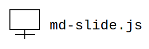

<!-- @css: /exts/mint.css -->
<!-- @css: /exts/ribbons.css -->
<!-- @presenter: Takeshi Kojima -->
<!-- @contact: kojima@tokushima-u.ac.jp -->
<!-- @affiliation: Tokushima University -->
<!-- @title: Create slides using Markdown and slideshow in web browser -->
<!-- @subtitle: md-slide.js -->
<!-- @date: 2025/3/6 -->

<!-- 表紙を生成 -->
<!-- @cover -->

<!-- このページはページ番号を表示しない -->
<!-- @page: no-page-number -->

<!-- @note: 
このように書くと，発表者ノートになる．
-->

---
# Grammer
## Page separation
* 水平ライン `---` でページを区切る
* Marp では heading 1 (`#`) でもページが区切られるが，本システムでは heading 1 では区切らない

---
## Multi-column Layout

* 段組は以下のような記法で記述できる

```
&lt;!-- @multicolumn: 1:1:1 --&gt;
1st
&lt;!-- @nextcolumn --&gt;
2nd
&lt;!-- @nextcolumn --&gt;
3rd
&lt;!-- @endmulticolumn --&gt;
```

* 以下のように表示される
<!-- @multicolumn: 1:1:1 -->
1st
<!-- @nextcolumn -->
2nd
<!-- @nextcolumn -->
3rd
<!-- @endmulticolumn -->


* 列数に制限はない
* `1:1:1` のところで各列の横幅の比率を指定する
* `<!-- @endmulticolumn -->` は明記せずとも，ページ区切り `---` で自動的に段組が終了する

---
<!-- @page: hide -->
# Hidden slide

---

## Code
* `highlight.js` によりコードのハイライトができる

<!-- @multicolumn: 1:1 -->
```python:Python
print("Hello")
```
<!-- @nextcolumn -->
```latex:LaTeX
\frac{dx}{dt} = x(x-1)
```
<!-- @endmulticolumn -->

---
## Figures and Tables
* キャプション付きの図表を簡潔に記述できる

<!-- @multicolumn: 1:1 -->
### Figure
<!-- @image-style: width: 600px -->

<!-- @nextcolumn -->
### Table
<!-- @caption: Table1: bar -->
| aaaa | b| a | b| a | b| a | b| a | b|
|---|--|---|--|---|--|---|--|---|--|
| a | b| a | b| a | b| a | b| a | b|
| aaaa | baaa| a | b| a | b| a | b| a | b|
| a | b| a | b| a | b| a | b| a | b|
| a | b| a | b| a | b| a | b| a | b|
<!-- @endmulticolumn -->

---
## Mathematical Expressions
* インライン形式とディスプレイ形式の両方に対応

<!-- @multicolumn: 1:1 -->
### Inline math
* Enclosing with `\\( ・ \\)` renders inline math: \\(x = \frac{1}{2}\\)
* Also, enclosing with `\( ・ \)` renders inline math: \(f(x, y, z(t))\)
<!-- @nextcolumn -->
### display math
* Enclosing with `\\[ ・ \\]` renders display math:
\\[
\frac{1}{2}
\\]
* Also, enclosing with `\[ ・ \]` renders display math:
\[
\frac{1}{2}[1]
\]
<!-- @endmulticolumn -->

---
## Text Formatting and Decoration
* Link: [This is a link](https://kjmtks.github.io/md-slide-js).
* Emphasis: *This is a emphasized text*.
* Italic: _This is a italic text_.
* Bold: **This is a bold text**.
* Strikethrough: ~~This is a strikethrough text~~.
* Blockquote:

> aaaa

---
## Variables
* 変数の代入と参照ができる
* 変数の代入

[: myvar = テスト :]
```
[: myvar = テスト :]
```
* 変数の参照: [:: myvar ::]
```
[:: myvar ::]
```


---
## 動画の埋め込み

* 専用の構文はない
* `video` タグで直接書けば動画を埋め込むことができる

```xml
&lt;video
  src="movie.mp4"
  poster="thumbnail.png"
  controls
  autoplay
  muted
  loop
  width="auto"
  height="90%"
  preload="metadata"&gt;
&lt;/video&gt;
```

* YouTube の動画埋め込みも可能．ただし，サイズは調整した方がよい

---
## CSSの読み込み

* デザインを調整したい場合などに

```
&lt;!-- @css: /exts/mint.css --&gt;
```

* <span class="ribbon-text red">TEST</span>

```
&lt;!-- @css: /exts/ribbons.css --&gt;
```


---
# Shortcut key

* `f`: スライドショー（フルスクリーンモード）の開始
  * `b`: ポインタの表示/非表示の切り換え
  * `c`: 簡易ペイントツールの使用/不使用の切り換え

---
<!-- @ul-class: fancy-hlists -->
* 111
  * aaa
  * bbb
* 222
  * aaa
  * bbb

---

<!-- @blockquote-class: callout -->
<!-- @blockquote-class: conclusion -->
<!-- @blockquote-class: strong -->
<!-- @blockquote-class: centering -->
> conclusion

<!-- @blockquote-class: callout -->
<!-- @blockquote-class: question -->
> question

<!-- @blockquote-class: callout -->
<!-- @blockquote-class: keypoint -->
> keypoint

<!-- @blockquote-class: callout -->
<!-- @blockquote-class: note -->
> note

<!-- @blockquote-class: callout -->
<!-- @blockquote-class: example -->
> example

<!-- @blockquote-class: callout -->
<!-- @blockquote-class: tip -->
> tip

<!-- @blockquote-class: callout -->
<!-- @blockquote-class: warning -->
> warning

<!-- @blockquote-class: callout -->
<!-- @blockquote-class: background -->
> background

---
<!-- @li-class: ribbon -->
<!-- @li-class: hint -->
<!-- @li-attr: label: Hint -->
* This is Hint
<!-- @li-class: ribbon -->
<!-- @li-class: note -->
<!-- @li-attr: label: Note -->
* This is Note
<!-- @li-class: ribbon -->
<!-- @li-class: tip -->
<!-- @li-attr: label: Tip -->
* This is Tip
<!-- @li-class: ribbon -->
<!-- @li-class: warning -->
<!-- @li-attr: label: Warning -->
* This is Warning
<!-- @li-class: ribbon -->
<!-- @li-class: example -->
<!-- @li-attr: label: Example -->
* This is Example
<!-- @li-class: ribbon -->
<!-- @li-class: question -->
<!-- @li-attr: label: Question -->
* This is Question
<!-- @li-class: ribbon -->
<!-- @li-class: conclusion -->
<!-- @li-attr: label: Conclusion -->
* This is Conclusion

---
<!-- このページはタイトルだけ -->
<!-- @page: no-content -->
# おわり
## 仕様は現時点のものです