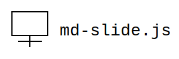

[: presenter = Takeshi Kojima :]
[: contact = kojima@tokushima-u.ac.jp :]
[: affiliation = Tokushima University :]
[: title = Create slides using Markdown and slideshow in web browser :]
[: subtitle = md-slide.js :]
[: date = 2025/3/6 :]

[: !cover :]  <!-- 表紙を作成 -->
[: page no-page-number :]  <!-- このページはページ番号を表示しない -->

<!-- note: 
このように書くと，発表者ノートになる．
-->

---
# Grammer
## Page separation
* 水平ライン `---` でページを区切る
* Marp では heading 1 (`#`) でもページが区切られているのが，本システムでは heading 1 では区切らない

---
## Multi-column Layout

* 段組は以下のような記法で記述できる

```
[[[
1st
||
2nd
||
3rd
]]]
```

* 以下のように表示される

[[[
1st
||
2nd
||
3rd
]]]


* 列数に制限はない

---
[: page hide :]
# Hidden slide

---

## Code
* `highlight.js` によりコードのハイライトができる

[[[
```python:Python
print("Hello")
```
||
```latex:LaTeX
\frac{dx}{dt} = x(x-1)
```
]]]

---
## Figures and Tables
* キャプション付きの図表を簡潔に記述できる

[[[
### Figure

||
### Table
*caption: Table1: bar*
| aaaa | b| a | b| a | b| a | b| a | b|
|---|--|---|--|---|--|---|--|---|--|
| a | b| a | b| a | b| a | b| a | b|
| aaaa | baaa| a | b| a | b| a | b| a | b|
| a | b| a | b| a | b| a | b| a | b|
| a | b| a | b| a | b| a | b| a | b|
]]]

---
## Mathematical Expressions
* インライン形式とディスプレイ形式の両方に対応

[[[
### Inline math
* Enclosing with `\\( ・ \\)` renders inline math: \\(x = \frac{1}{2}\\)
* Also, enclosing with `\( ・ \)` renders inline math: \(f(x, y, z(t))\)
||
### display math
* Enclosing with `\\[ ・ \\]` renders display math:
\\[
\frac{1}{2}
\\]
* Also, enclosing with `\[ ・ \]` renders display math:
\[
\frac{1}{2}[1]
\]
]]]

## Text Formatting and Decoration
* Link: [This is a link](https://kjmtks.github.io/md-slide-js).
* Emphasis: *This is a emphasized text*.
* Italic: _This is a italic text_.
* Bold: **This is a bold text**.
* Strikethrough: ~~This is a strikethrough text~~.
* Blockquote:

> aaaa

---
## Variables
* 変数の代入と参照ができる
* 変数の代入
[: myvar = テスト :]
```
[: myvar = テスト :]
```
* 変数の参照: [:: myvar ::]
```
[:: myvar ::]
```

---
# Shortcut key

* `f`: スライドショー（フルスクリーンモード）の開始
* `c`: 発表者ノートの表示と非表示の切り換え